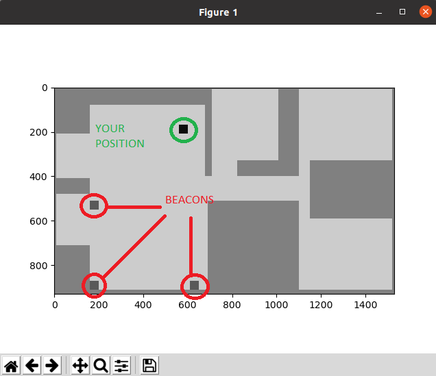

# BLE-INDOOR-POSITIONING
## Overview
This project lets your linux device broadcast it's position indoors with refernce to three fixed BLE broadcasters.
## Features
1) Applies Kalman Filter on the RSSI Signals being recieved to get a stable value of the signal.
2) Applies Log Distance Path Loss Model to compensate for the weakened RSSI signal in indoor environments.
3) Uses trilateration (from the distance from the three BLE devices) to roughly estimate your position in 2D (in m) from a fixed origin. 

**Here is an example of me using it inside my house.**

